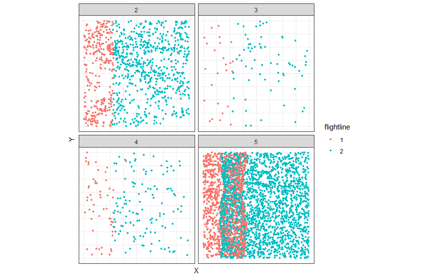
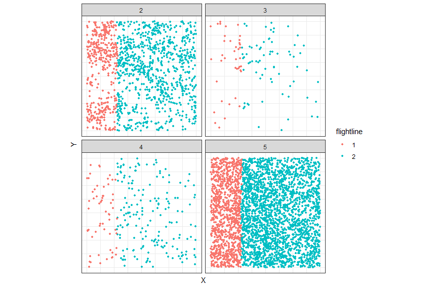
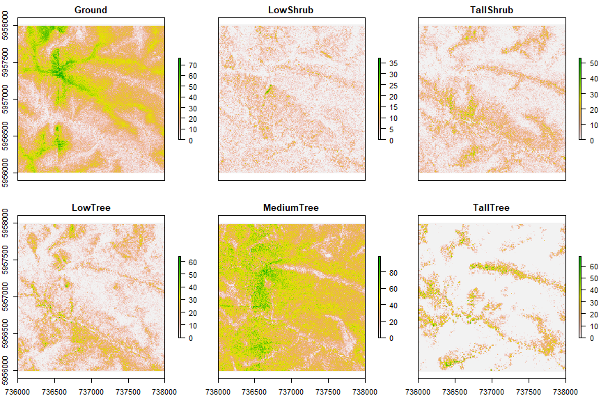
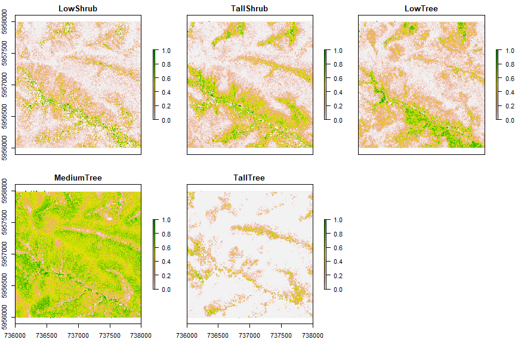

```{r setup, include = FALSE}
knitr::opts_chunk$set(
  collapse = TRUE,
  comment = "#>",
  eval = FALSE,
  fig.width = 8,
  fig.height = 6
)
```


## Load the package and define path to data

```{r}

library(CERMBlidar)

library(here)
library(ggplot2)

theme_set( theme_bw() )

# Data directory on local machine
DATA_DIR <- here("..", "test_data", "AHD")

```

## Import a tile from disk

The function `prepare_tile` imports data from a LAS file and normalizes point heights to ground level. Note that you will probably see a warning message relating to the normalizing step. This is issued by the underlying `lidR` package function and can be safely ignored.

```{r}

path <- file.path(DATA_DIR, "Bega201804-LID2-C3-AHD_7365956_55_0002_0002.las")
las <- prepare_tile(path)

```

## Quick flight lines to check for overlap

```{r}

plot_flightlines(las) + facet_wrap(~Classification )

```



## Remove the overlap for points in class 5 

```{r}

las <- remove_flightline_overlap(las, classes = 5)

plot_flightlines(las) + facet_wrap(~Classification)

```



## Get point counts for vegetation strata

The package includes lookup tables for vegetation strata as defined by Specht (StrataSpecht); and the NSW Office of Environment and Heritage (StrataOFH: overall fuel hazard).

```{r eval=TRUE}

CERMBlidar::StrataSpecht

```

```{r eval=TRUE}

CERMBlidar::StrataOFH

```

Users can also define strata by providing a lookup table as a three column data frame in the format shown above. Note that 'ground' must be included in the lookup table. Order of columns and rows is not important, but overlapping strata heights will result in an error.

Getting and displaying the ground and vegetation point counts for Specht strata:

```{r}

# This function returns a RasterStack object with layers 
# corresponding to strata
rcounts <- get_stratum_counts(las, StrataSpecht, res = 10)
plot(rcounts)

```



## Vegetation cover estimates for strata

Mean cover estimates are derived from the rasters of point counts by stratum. 

```{r}

rcover <- get_stratum_cover(rcounts)
plot(rcover)

```



If point counts are not needed for any other purpose, these two steps can be combined using the `%>%` operator from the dplyr package.

```{r}

rcover <- las %>%
  get_stratum_counts(StrataSpecht, res = 10) %>%
  get_stratum_cover()

```

